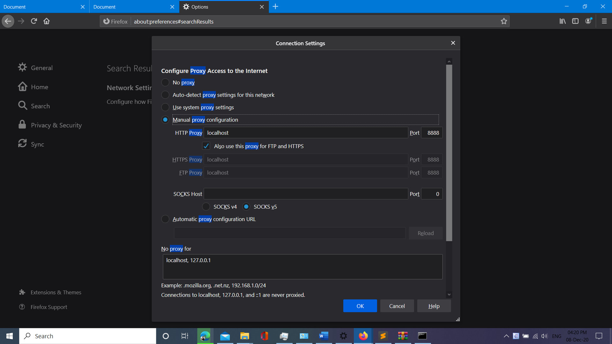

# ProxyServer with Python Socket - TCP

Lời đầu tiên thì chào mừng các bạn đến với cái đồ án này.

Đây là đồ án Proxy Server mình nhân được khi học tại Đại học Khoa học Tự nhiên môn Mạng máy tính

Một phần do mình tìm hoài mà chả thấy repo nào code bằng Python mà có mô tả và comment rõ ràng, thứ 2 là do mình là người chơi hệ Python nên giờ các bạn có các Repo ở đây.

---
Demo
======
Các bạn có thể tìm thấy phần demo ở [đây](https://www.youtube.com/watch?v=fcCO4kmFJ28)

Chạy chương trình
======
Nhớ dùng Mozilla vì bạn có thể nối Mol đến Proxy manually mà không phụ thuộc vào cả hệ thống máy tính của bạn (NHƯ TRONG VIDEO DEMO nha <3 )


```bash
git clone https://github.com/dungxibo123/ProxyServer
cd ProxyServer/src
python3 src.py
```


Giải thích
======


Như các bạn có thể thấy ở trên, Proxy Server là trung gian giữa Client và Web Server

Nhiệm vụ của bạn sẽ là nhận câu hỏi (request) từ CLIENT và xem xem trong đó là gì, sau đó "hỏi giúp" CLIENT đúng câu hỏi đó tới SERVER. Và cũng chính bạn là người sẽ nhận được câu trả lời từ SERVER, sau đó gửi y chang về CLIENT.

Khá đơn giản và dễ hiểu ?

Vầng, điều khó hiểu ở đây là làm thế nào biết được CLIENT(mà ở đây là Browser của bạn) gửi gì lên cho bạn.

Bạn visualize cái đống câu hỏi (Request) đó như thế lào. Đúng đây là câu hỏi mình tự hỏi bản thân mình.

Thật ra có 2 cách

* Nếu bạn học WireShark (hay bất kỳ cái gì thầy bắt bạn dùng để bắt gói tin ở Proxy) thì bạn dùng nó

* Cách 2, nó sẽ **hard core** hơn tí nhưng mà nó vui và thử thách. Vầng, đó là chép code, bạn search `hex_dumps` trên Google chắc có đầy á =))))))))))))))))))

Mà nó sẽ trông như thế này nè
`GET http://uhm.vn/ HTTP/1.1\r\nHost: uhm.vn\r\nUser-Agent: Mozilla/5.0 (Windows NT 10.0; Win64; x64; rv:83.0) Gecko/20100101 Firefox/83.0\r\nAccept: text/html,application/xhtml+xml,application/xml;q=0.9,image/webp,*/*;q=0.8\r\nAccept-Language: en-US,en;q=0.5\r\nAccept-Encoding: gzip, deflate\r\nConnection: keep-alive\r\nUpgrade-Insecure-Requests: 1\r\n\r\n`

Yeah mình biết nó nhìn khó chịu và khá là mệt não, bạn nào muốn tìm hiểu thêm mình sẽ để link ở [đây](https://www.tutorialspoint.com/http/http_requests.htm) (hy vọng các bạn hiểu chứ mình từ chối hiểu luôn)

Thầy mình chỉ bắt Proxy cho HTTP thôi, nên đối với các bạn bị có thêm HTTPS thì mình xin lỗi =)))
Anyway nó chỉ khác nhau một tí thôi á, dont worry =)))

Các bạn có thể đọc sự khác nhau ở [đây](https://www.globalsign.com/en/blog/the-difference-between-http-and-https#:~:text=HTTPS%20is%20not%20the%20opposite%20of%20HTTP%2C%20but,slightly%20different%2C%20more%20advanced%2C%20and%20much%20more%20secure) và làm á.

Xử lý đầu vào
=======
**Oker sau khi biết nó làm cái gì rồi, việc quan trọng là bạn làm gì với đống thông tin này.**

*Fact: Mình có tìm thấy một số repo split thông tin, nhưng mình không dùng, tại vì nó làm cho nhóm mình khó hiểu hơn mà thôi (nhóm mình người chơi hệ HTML/CSS/JS mà ngồi giải thích đống Python cho nó nữa thì =))) )*


Vậy điều quan trọng ở đây là cần trích được cái URL từ cái đống REQUEST kia

Nếu bạn visual đủ nhiều bạn sẽ thấy trong đống đó ở bất kỳ cái URL nào cũng có cái đống này nè ` :\\`, nên mình chỉ cần tìm vị trí của nó (gợi ý thì từ đây bạn có thể biết luôn giao thức của nó là HTTP hay HTTPS)

Hmmm, oker có URL rồi có `HOST` rồi thì bạn cần` PORT` (để làm gì á - tính sau nha)

Mình tin bạn sẽ tự tìm được cái cổng ấy <3. Mà để đỡ suy nghĩ thì cứ đọc code (hiểu hay không mình hong chắc nha).

SAU KHI CÓ ĐƯỢC `PORT` và `HOST`
===
## Đa luồng
Oker đầu tiên đến với khái niệm đa luồng tí nha
Loot khái niệm đa luồng ở [đây nè ha](https://viblo.asia/p/da-luong-trong-python-multithreading-WAyK8MO6ZxX)

Còn muốn thử đa luồng khác thì dùng 2 đoạn code sau nha

```python
import _thread #thread cho python2
import time
#code không dùng thread 
#Đống này thì in tuần tự rồi ha
for i in range(10):
    print(i)
# code dùng thread
def Print(x):
    print(x)
for i in range(10):
    # Ngắn gọn thì vậy_thread.start_new_thread(lambda x: print(x),(i))
    # Dài hơn tí thì vậy
    _thread.start_new_thread(Print,(i))
    
time.sleep(0.1) #chờ nó in ra in ra
#Đoạn code này sẽ in tùm lum số, chạy mỗi lần in mỗi kiểu
#Quào sau khi chạy đống này locally	thì mình mới hiểu thêm về Multithreading
```
Hy vọng nó chạy được :v mình code trực tiếp trên markdown, chưa debug =))))))))))))

## Hỏi `SERVER` giúp `CLIENT`

Như cái ảnh về Proxy ở trên, bạn nên có một cái "dây" (kết nối) giữa chính bạn (Proxy) và thằng `SERVER`, ủa chứ giờ không có kết nối thì hỏi bằng cách nào đúng không :)))

Okay tạo nó bằng `socket` bình thường hén.

Rồi gửi bằng socket.send, nhớ decode lại dưới bytes object. Tại vì socket ở Python3 và cả Python3 nữa rất nghiêm ngặt trong phân biệt giữa `bytes` object và `str` object. (Bạn học tới năm 2 rồi debug mấy cái này easily mà).


Sau khi gửi, rõ ràng nếu bạn có được thứ bạn muốn đó là dữ liệu, thì bạn cứ gửi về `CLIENT`, thế là xong, còn tại sao mình kẹp ở trong thằng `while 1`, là do khi gửi dữ liệu, `SERVER` không gửi một lần, mà là gửi từng tí từng tí. Nhưng bạn thì phải nhận hết. Cứ có dữ liệu tới thì nhận rồi lại gửi. Đến khi nào mà hết nhận được gì (lúc dó thì `SERVER` gửi xong rồi. Mình cũng done) thì data sẽ nhận giá trị `None`, lúc đó `if data` sẽ false và đi vào`else` -> break vòng lặp

Khỏi lo về việc tắt `thread` nhớ, vì hãy tưởng tượng `thread` nó như một chương trình. Hết chương trình tự kết thúc `thread`.

Well, đó là tất cả những gì mà tụi mình biết.

***Lưu ý: bạn có thể tự format file `./403/index.html` để có được page 403 đẹp hơn á =)))***

Trong quá trình nghiên cứu, tìm hiểu, tụi mình chân thành cảm ơn anh Võ Quốc An và 2 người bạn đã giúp tụi mình trong việc nhận ra sai lầm khi chạy thử. Cũng chân thành cảm ơn giảng viên bộ môn của tụi mình đã hỗ trợ trong nhiều khía cạnh.

Chúc các bạn may mắn

***FIT 25 năm - HCMUS***


